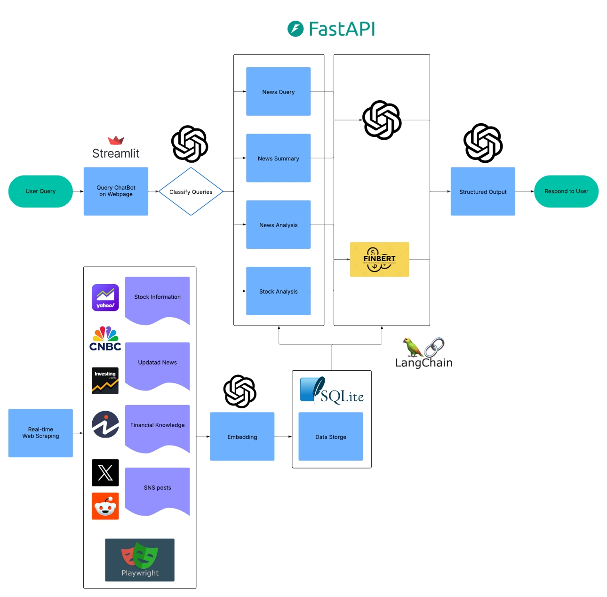

# FiNN-AI

This project implements an AI-powered financial news analysis system that collects and processes financial news, social media data, and financial terms to provide intelligent responses to user queries using a RAG (Retrieval-Augmented Generation) system.



## Features
- Real-time financial news data collection and analysis
- Hourly automated scraping with exponential backoff and retry mechanisms
- Stock price data retrieval and technical analysis
- Stock impact analysis (which stocks are affected by news)
- Social media sentiment analysis for financial markets
- Financial knowledge base with terminology and definitions
- Multi-page Streamlit interface:
  - Market Analysis dashboard with stock charts
  - Dark-themed chat interface with AI assistant
- Advanced RAG implementation with structured reasoning chains
- Embeddings-based semantic search and retrieval
- SQLite database for data persistence
- Direct retrieval of most recent news with AI-generated summaries

## Prerequisites
- Python 3.8 or higher

## Installation

1. Clone the repository:
```bash
git clone https://github.com/johnson70630/FiNN-AI.git
cd FiNN-AI
```

2. Install dependencies:
```bash
pip install -r requirements.txt
```

3. Set up environment variables:
Copy `.env.template` to `.env` and fill in your API keys:
```
# OpenAI API Key
OPENAI_API_KEY=your_openai_api_key

# LangSmith (Optional)
LANGSMITH_TRACING=your_langsmith_tracing
LANGSMITH_ENDPOINT=your_langsmith_endpoint
LANGSMITH_API_KEY=your_langsmith_api_key
LANGSMITH_PROJECT=your_langsmith_project

# Twitter Playwright Login 
TWITTER_USERNAME=your_twitter_username
TWITTER_PASSWORD=your_twitter_password

# Reddit API Keys 
REDDIT_CLIENT_ID=your_reddit_client_id
REDDIT_CLIENT_SECRET=your_reddit_client_secret
REDDIT_USER_AGENT=your_reddit_user_agent
```

## Running the Project

### Quickstart (Recommended)

The easiest way to run the entire application:

```bash
python run.py
```

This will:
1. Start the backend API server
2. Launch the Streamlit frontend
3. Open the web interface in your browser
4. Show logs from both components in a single terminal

Press Ctrl+C to stop all services.

### Alternative: Running Components Separately

#### Backend API Server

```bash
python backend/main.py
```

This starts the FastAPI server that provides endpoints for accessing news, social media posts, and financial terms.

#### Frontend Application

```bash
streamlit run frontend/app.py
```

This launches the Streamlit user interface that connects to the backend API.

## Project Structure
```
.
├── run.py                # Main launcher script
├── backend/              # Backend API and core functionality
│   ├── main.py           # FastAPI entry point
│   ├── core/             # Core modules
│   │   ├── database.py   # Database connections and models
│   │   └── models.py     # Data models
│   ├── scrapers/         # Data collection modules
│   │   ├── news_scraper.py           # News article collection
│   │   ├── social_media_scraper.py   # Social media collection
│   │   ├── financial_knowledge.py    # Financial terms collection
│   │   └── scraper_service.py        # Orchestration service
│   └── services/         # Core business logic
│       ├── rag_service.py                # RAG implementation for Q&A
│       ├── chain_service.py              # Chain-based structured reasoning
│       ├── stock_analysis_service.py     # Stock analysis and sentiment
│       ├── stock_impact_service.py       # News impact on stocks
│       ├── embedding_service.py          # Vector embeddings for DB items
│       └── simple_query_service.py       # Fallback query service
├── frontend/            # User interface
│   ├── app.py           # Streamlit main page (Market Analysis)
│   └── pages/           # Multi-page Streamlit app
│       └── 01_Chat.py   # Chat interface with AI assistant
├── data/                # Data storage directory (SQLite database)
├── requirements.txt     # Project dependencies
└── README.md           # Project documentation
```

## Usage

### Data Collection
The system will automatically collect data from various sources:
- Financial news articles from major financial news websites
- Social media posts from finance-related channels
- Financial terminology and definitions
- Stock price data and market trends

### Web API
1. Start the API server with `python backend/main.py`
2. Access the following endpoints:
   - `/news`: Get latest news articles
   - `/social`: Get social media posts
   - `/terms`: Get financial terms
   - `/query`: Submit natural language queries
   - `/stocks`: Get stock price information
   - `/stock/{symbol}`: Get detailed stock data
   - `/stock-analysis/{symbol}`: Get comprehensive stock analysis
   - `/news/impact`: Analyze news impact on stocks

### User Interface
The application has a multi-page Streamlit interface:
1. **Market Analysis**: Stock analysis, price charts, news feed, and social media monitoring
2. **Chat**: Conversational interface to interact with the AI assistant about financial topics

## Troubleshooting

### API Keys
- Check environment variables are correctly set in `.env`
- Ensure all API keys are valid and have necessary permissions
- OpenAI API key is required for the RAG functionality
- Twitter and Reddit API keys are needed for social media scraping

### RAG Service Errors
- If the chatbot fails to provide meaningful answers, check that:
  - Your OpenAI API key is valid and has sufficient credits
  - The database contains enough data (at least some news articles and terms)
  - The query is related to financial topics

### Detailed Logs
- For detailed error messages, check the application logs in the terminal when running `run.py`

## License

This project is licensed under the MIT License - see the LICENSE file for details.
